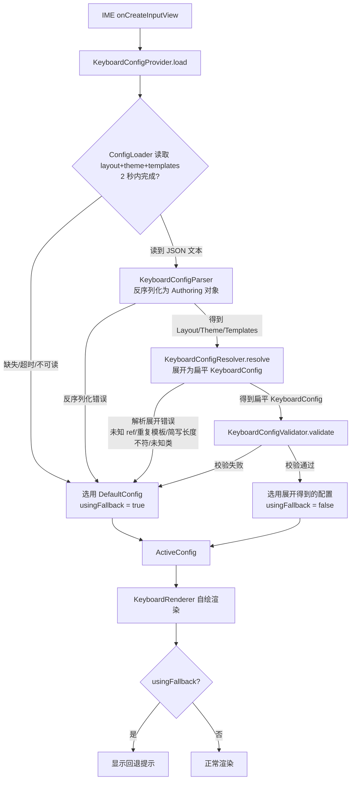
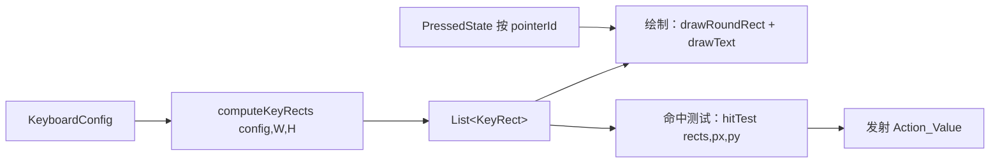
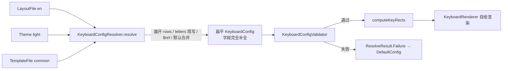
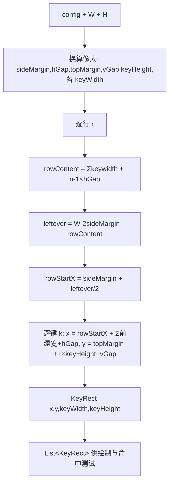

# 设计文档：可配置键盘 UI（configurable-keyboard-ui）

## Overview

（概述）

本特性将 SnapInput 的键盘从硬编码的 QWERTY 布局（`KeyboardLayout.kt`）重构为由外部 JSON 配置驱动的**自绘**渲染系统。输入法视图被明确划分为自上而下堆叠的两个区域：

1. **顶部区域（Top_Region）**：独立组件，其存在、布局与内容**不**受 Keyboard_Config 控制。它在两种互斥模式间切换——无活动输入（Word_Buffer 为空）时显示工具栏（Toolbar），有活动输入（Word_Buffer 非空）时显示候选词栏（Prediction_Bar），提交或清空后回到工具栏。本轮 Toolbar 恰好包含两个元素：居左的 Apps_Entry（占位，无功能）与居右的 Collapse_Keyboard_Button（功能键，按下时隐藏输入法）。
2. **键盘区（Keyboard_Region）**：唯一一块自绘、由 Keyboard_Config 驱动的区域。

### 两级配置模型（编写期 → 解析展开 → 扁平运行时）

为减少多语言键盘之间的配置重复（例如英文与法文共享绝大多数按键与全部样式），本特性引入**两级配置**，并将“复用复杂度”集中隔离在一个纯函数 **Resolver** 内：

```
Authoring_Config（源格式，分文件：themes / templates / layouts，Scheme B）
        │
        ▼  KeyboardConfigResolver.resolve(layout, theme, templates)  —— 纯函数
扁平运行时 KeyboardConfig（既有模型，schema 与约束不变）
        │
        ▼
Keyboard_Renderer（自绘渲染，不变） / Validator（不变）
```

要点：

- **运行时/渲染器/校验器完全不变**：Resolver 的产物就是既有的扁平 `KeyboardConfig`（见 Data Models）。渲染、缩放、布局数学、命中测试、多指、校验等下游组件**无任何改动**——它们只消费“已展开、字段完全补全”的扁平配置。所有“复用”带来的复杂度都被限制在 `core` 的 Resolver 内。
- **复用只通过共享 Theme + Templates 实现**：Layout 之间**不**互相继承、不互相引用；依赖关系是 `layout → theme + templates`，为**有向无环**（DAG）。多语言复用的收益来自“多个 layout 引用同一个 theme 与同一组 templates”，而各语言 layout 只在字母行上不同。
- **Active_Layout 本轮固定为 "en"**：语言切换仍属范围之外，但 authoring 格式（theme/templates/layouts 分文件 + 模板引用）已为多语言/切换预留（switch-ready）。

### 资产文件组织（Assets Layout）

编写期源文件按职责分目录存放（打包于应用 assets）：

```
keyboard/themes/{themeId}.json       一个 Theme（全部样式比例 + Corner_Radius + 按 Key_Class 的 Key_Defaults）
keyboard/templates/{name}.json       一组命名 Key_Template + Row_Template
keyboard/layouts/{layoutId}.json     一个单语言 Layout（引用 theme + templates + rows 组合）
```

一组具体示例（即 DefaultConfig 的 authoring 源）：

`keyboard/themes/light.json`（集中定义全部键盘级样式比例与各 Key_Class 默认值）：

```json
{
  "id": "light",
  "keyboardRegionHeightRatio": 0.27,
  "sideMarginRatio": 0.019444,
  "horizontalGapRatio": 0.011111,
  "topMarginRatio": 0.018518,
  "bottomMarginRatio": 0.018518,
  "verticalGapRatio": 0.037037,
  "normalKeyHeightRatio": 0.212963,
  "cornerRadiusDp": 8.0,
  "keyDefaults": {
    "letter": {
      "widthRatio": 0.086111,
      "normalBackgroundColor": "#FFFFFFFF",
      "mainText": { "color": "#FF000000", "sizeRatio": 0.45 },
      "subLabel": { "color": "#80000000", "sizeRatio": 0.22 }
    },
    "special": {
      "widthRatio": 0.127778,
      "normalBackgroundColor": "#FFADB3BD",
      "mainText": { "color": "#FF000000", "sizeRatio": 0.40 }
    }
  }
}
```

`keyboard/templates/common.json`（可复用的特殊键与功能行）：

```json
{
  "keyTemplates": {
    "shift": { "keyClass": "special", "action": "Shift", "widthRatio": 0.134722, "mainText": { "content": "⇧" } },
    "del":   { "keyClass": "special", "action": "Del",   "widthRatio": 0.134722, "mainText": { "content": "⌫" } },
    "space": { "keyClass": "special", "action": " ",     "width": "fill",        "mainText": { "content": "" } },
    "enter": { "keyClass": "special", "action": "Enter", "widthRatio": 0.127778, "mainText": { "content": "换行" } },
    "123":   { "keyClass": "special", "action": "123",   "widthRatio": 0.127778, "mainText": { "content": "123" } },
    "lang":  { "keyClass": "special", "action": "中/英",  "widthRatio": 0.127778, "mainText": { "content": "中/英" } }
  },
  "rowTemplates": {
    "functionRow": {
      "keys": [ "$123", { "keyClass": "letter", "action": "，", "mainText": { "content": "，" }, "subLabel": { "content": "。" } }, "$space", "$lang", "$enter" ]
    }
  }
}
```

`keyboard/layouts/en.json`（紧凑：字母行用 `letters` 简写 + `$ref`）：

```json
{
  "theme": "light",
  "templates": ["common"],
  "rows": [
    { "letters": "QWERTYUIOP", "subLabels": ["1","2","3","4","5","6","7","8","9","0"] },
    { "letters": "ASDFGHJKL",  "subLabels": ["-","/",":",";","(",")","~","“","”"] },
    { "letters": "ZXCVBNM", "subLabels": ["@",".","#","、","?","!","…"], "lead": "$shift", "trail": "$del" },
    "$functionRow"
  ]
}
```

复用收益的直观说明：若新增法文布局 `keyboard/layouts/fr.json`，它复用同一个 `"theme": "light"` 与同一组 `"templates": ["common"]`，**只**需改写三排字母行的 `letters`（如 `"AZERTYUIOP"` / `"QSDFGHJKLM"` / `"WXCVBN"`）与各自 `subLabels`，功能行、特殊键、全部样式比例与默认值都无需重复编写。

> **关于 `$space` 的填充宽度（Fill_Width）：** `common.json` 中 `$space` 的宽度声明为 `"width": "fill"`（而非固定的 `0.447222`），表示 Space 占据其所在功能行的**剩余宽度**；同一功能行的其余按键（`$123`、逗号键、`$lang`、`$enter`）仍为固定宽度。Resolver 在英文默认布局、360×800 参考下将该 fill 展开为具体的 `Key_Width_Ratio = 161/360 ≈ 0.44722`（即原占位值），并使该行水平占用合计 = 1.0。由于 `$space` 写成 fill，`fr.json`（10 键功能行）等其他布局可**原样复用 `$space` 模板**而无需为每种语言重算固定宽度——Space 会按各自功能行的剩余宽度自动填充为不同的具体比例。

### 两个渲染层面的核心变化

**（一）单画布自绘，取代组件组合。** 旧实现用 `Column { Row { KeyButton... } }` 的方式为每个按键创建一个 Composable。本特性改为**单个自绘 Compose 组件**：键盘区是一块统一的 `Canvas`/`Drawing_Surface`，在一次绘制中画出所有按键的圆角背景（drawRoundRect）、主文本与子标签（通过 native `Paint` 的 `drawText` 或 `drawIntoCanvas`）。理由有二——其一，单画布避免了上百个 Composable 节点的重组与布局开销，在连续输入时更容易稳定维持 60fps；其二，单画布配合 `pointerInput` 原始指针事件，可直接、精确地实现多指触摸（rollover）控制，而组件组合方式下每个子组件各自消费触摸事件，难以做跨键的多指仲裁。

**（二）比例驱动、分辨率自适应的尺寸模型，取代绝对 dp/sp。** 旧实现把外边距、间距、字号写成固定 dp/sp。本特性中**所有尺寸类配置值均为无单位比例（ratio）**：以 360×800 参考分辨率标定，但仅存储比例，运行时根据设备实际像素宽高 W、H 换算为像素。唯一例外是 `Corner_Radius`，它是固定 dp 值，不随分辨率缩放。文本字号也是比例（相对正常键高），不使用 sp、不跟随系统字号缩放，以保证跨设备视觉一致。

### 设计目标

- **声明式分层配置**：键盘区的布局与外观由分层的编写期文件（theme/templates/layouts）声明，多语言可共享 theme 与 templates，显著减少重复。
- **复用复杂度隔离**：所有“引用展开/默认合并/简写展开”仅存在于纯函数 Resolver；渲染、缩放、布局数学、校验等下游不变。
- **分辨率自适应**：同一份配置在任意 W×H 设备上按比例呈现一致布局。
- **健壮回退**：任何加载/反序列化/解析展开/校验失败都收敛到内置 `DefaultConfig`，键盘永不崩溃、永不空白。
- **绘制与命中测试单一真相源**：`computeKeyRects` 同时供渲染与触摸命中使用，确保“看到的”即“点到的”。
- **可测试性**：authoring 反序列化、Resolver 展开、配置解析/序列化、校验、布局数学、命中测试、输入状态机均为不依赖 Compose 的纯函数，便于在 JVM 上做属性测试。

### 关键设计决策

| 决策 | 选择 | 理由 |
| --- | --- | --- |
| 配置分层 | 编写期分文件（theme/templates/layouts，Scheme B）→ Resolver → 扁平运行时配置 | 多语言共享样式与按键规格，减少重复；运行时模型保持简单 |
| 复用方式 | 仅共享 Theme + Templates，Layout 间无继承（DAG） | 依赖关系简单可控、无环，易于展开与校验 |
| Resolver | `core` 内纯函数 `KeyboardConfigResolver.resolve(...)` | 确定性、可在 JVM 属性测试；与 Compose 无关 |
| 运行时模型 | 复用既有扁平 `KeyboardConfig`（不变） | 渲染/缩放/布局/校验下游零改动 |
| 键盘区渲染 | 单画布自绘（Canvas + native Paint） | 性能（避免大量 Composable）+ 直接多指控制 |
| 尺寸模型 | 无单位比例 + 运行时换算像素 | 分辨率自适应；配置不绑定具体分辨率 |
| 圆角半径 | 固定 dp（不缩放） | 视觉细节在不同分辨率上保持物理一致 |
| 文本字号 | 比例 × 正常键高（非 sp） | 跨设备一致，不受系统字号缩放干扰 |
| 序列化库 | kotlinx.serialization（新增到版本目录） | 编译期序列化器、类型安全，适合 round-trip 与 authoring 反序列化 |
| 颜色表示 | 模型中保存 `#AARRGGBB` 字符串，绘制时解析 | 序列化无精度损失，校验集中一处 |
| 布局数学位置 | `core`（纯 Kotlin，无 Compose 依赖） | 坐标/缩放/命中测试可在 JVM 上属性测试 |
| 多指触摸 | `pointerInput` + `awaitPointerEvent` 原始事件 | 按 Pointer_Identifier 独立跟踪，支持 rollover |
| 默认配置 | 以 authoring 格式编写、展开结果编译进应用的 `DefaultConfig` | 视为永远合法，最终回退 |
| 顶部区域 | 独立组件，不受配置控制 | 本轮范围限定；后续再做可配置化 |

## Architecture

（架构）

### 模块划分与组件位置

```
app（宿主 IME）
  └─ SnapInputMethodService
       ├─ 持有 KeyboardConfigProvider（编排 加载→解析→校验→回退）
       ├─ 维护 Word_Buffer 状态，驱动 Top_Region 在 Toolbar / Prediction_Bar 间切换
       ├─ 用 ComposeView 挂载 Column { TopRegion(...); KeyboardRenderer(...) }
       └─ 将 Action_Value 落到 InputConnection（既有逻辑）

core（纯 Kotlin / 无 Compose 依赖的领域层）
  └─ config/
       ├─ authoring/  编写期数据模型（@Serializable，源格式）：
       │              Theme / KeyDefaults / TextStyleDefaults
       │              TemplateFile / KeySpec / TextSpec
       │              LayoutFile / RowSpec（LettersRow / KeysRow）/ 引用解析
       ├─ KeyboardConfigResolver     纯函数：展开 authoring → 扁平 KeyboardConfig
       ├─ model/   KeyboardConfig / RowConfig / KeyConfig / TextStyleConfig / SubLabel（@Serializable，扁平运行时模型，不变）
       ├─ KeyboardConfigParser      运行时配置解析 + 序列化 + authoring 反序列化（kotlinx.serialization Json）
       ├─ KeyboardConfigValidator   范围 / 颜色格式 / 填充约束 / 垂直分区校验（不变）
       ├─ DefaultConfig             以 authoring 写就的内置默认配置（其展开结果即扁平默认；比例参考值来自 Requirement 6）
       ├─ ConfigLoader（接口）      读取 layout/theme/template 原始 JSON 文本
       ├─ AssetConfigLoader         从 AssetManager 读取（共享 theme/template 缓存，2 秒总超时）
       ├─ KeyboardConfigProvider    编排：加载→反序列化(authoring)→展开(resolve)→校验→回退，产出 ActiveConfig
       └─ layout/  纯布局数学（无 Compose 依赖）：
                   KeyRect / computeKeyRects(config, W, H) / scaling 工具 / derivePressedColor
                   hitTest(rects, px, py)

feature:keyboard（Compose 自绘渲染层，依赖 :core；仍只消费展开后的扁平 KeyboardConfig，无改动）
  ├─ KeyboardRenderer       单画布自绘 Composable（消费 computeKeyRects 的结果）
  ├─ PressedState           按 Pointer_Identifier 跟踪按下态，驱动重绘
  ├─ MultiTouchHandler      pointerInput + awaitPointerEvent，多指命中与发射
  ├─ ColorParsing           parseArgbColor()：#AARRGGBB → Compose Color
  ├─ ShiftState             shift / caps lock 状态机（纯逻辑）
  └─ TopRegion              工具栏（Apps_Entry / Collapse_Keyboard_Button）与候选词栏切换组件

feature:prediction
  └─ PredictionBar          复用，由 TopRegion 在 Word_Buffer 非空时承载
```

**模块归置（Module Placement）说明：**

- `core` 内新增 `config/authoring`（Theme / TemplateFile / LayoutFile / KeySpec / RowSpec 等编写期模型）与 `KeyboardConfigResolver`（纯函数），与既有 `KeyboardConfigParser` / `KeyboardConfigValidator` / `KeyboardConfigProvider` / 扁平 `model` / `layout` 布局数学并列。
- `KeyboardConfigResolver` 与 authoring 模型**均不依赖 Compose**，可在纯 JVM 单元/属性测试中验证。
- `feature:keyboard` **不变**：仍只消费展开后的扁平 `KeyboardConfig`，对 authoring/resolve 无感知。

### 数据流（创建输入视图时）



> 说明：相对旧流程，新增了 **反序列化(authoring) → resolve(展开)** 两步；展开得到的扁平 `KeyboardConfig` 之后的校验、渲染、缩放、命中测试均与既有流程一致。

### 渲染与触摸的单一真相源



`computeKeyRects(config, W, H)` 是一个纯函数，返回每个按键的像素矩形 `KeyRect`。渲染遍历 `KeyRect` 画背景/文本；触摸处理用同一组 `KeyRect` 做命中测试。两者共享同一来源，从根本上保证“看到的位置”与“点到的位置”一致。

### Top_Region 与 Keyboard_Region 的组合

`SnapInputMethodService` 用一个 `Column` 自上而下放置 `TopRegion` 与 `KeyboardRenderer`。`TopRegion` 高度 = H × `TOP_REGION_HEIGHT_RATIO`（`TopRegion` 组件内置常量，非 Keyboard_Config 字段），`KeyboardRenderer` 高度 = H × Keyboard_Region_Height_Ratio。服务持有 `Word_Buffer`：

- `Word_Buffer` 为空 → `TopRegion` 渲染 Toolbar（Apps_Entry + Collapse_Keyboard_Button）。
- `Word_Buffer` 非空 → `TopRegion` 渲染 Prediction_Bar（候选词）。
- 提交或清空 `Word_Buffer` → 回到 Toolbar。

`Word_Buffer` 的增删由按键 Action_Value 在 `handleKey` 中驱动（既有逻辑保留并扩展），并以 Compose 状态形式上抛给 `TopRegion`。

## Components and Interfaces

（组件与接口）

### ConfigLoader（core）

```kotlin
/** 读取编写期原始配置 JSON 文本（layout / theme / template）。实现可来自 assets、文件或测试桩。 */
interface ConfigLoader {
    /**
     * 读取 Active_Layout 的 Layout 文件、其引用的 Theme 文件与全部 Template 文件的原始 JSON 文本。
     * 共享的 theme/template 会被缓存以避免重复读取。
     * 任一文件缺失/不可读，或全部读取未在 2 秒内完成，返回携带原因的 Failure。
     */
    suspend fun loadAuthoringSources(layoutId: String): LoadResult
}

/** 一次加载得到的全部编写期原始文本。 */
data class AuthoringSources(
    val layoutId: String,
    val layoutJson: String,
    val themeId: String,
    val themeJson: String,
    val templates: Map<String, String>   // name -> JSON 文本（按 layout.templates 顺序）
)

sealed interface LoadResult {
    data class Success(val sources: AuthoringSources) : LoadResult
    data class Failure(val error: ConfigError) : LoadResult   // MISSING_REFERENCED_FILE / 超时 / IO
}

/**
 * 基于 Android AssetManager 的实现：
 *  - 读取 keyboard/layouts/{layoutId}.json，解析其 theme 与 templates 引用名，
 *    再读取 keyboard/themes/{themeId}.json 与各 keyboard/templates/{name}.json。
 *  - 缓存已读取的共享 theme/template 文本（Requirement 4.2）。
 *  - 全部读取设 2 秒总超时（Requirement 4.1 / 4.6）。
 */
class AssetConfigLoader(
    private val assets: AssetManager
) : ConfigLoader
```

### 编写期数据模型（core，config/authoring，@Serializable）

编写期模型与扁平运行时模型**完全分离**：authoring 字段大多可选（缺省由 Resolver 按优先级补全），颜色仍为 `#AARRGGBB` 字符串。

```kotlin
// ---- Theme：keyboard/themes/{themeId}.json ----
@Serializable
data class Theme(
    val id: String,
    val keyboardRegionHeightRatio: Float,
    val sideMarginRatio: Float,
    val horizontalGapRatio: Float,
    val topMarginRatio: Float,
    val bottomMarginRatio: Float,
    val verticalGapRatio: Float,
    val normalKeyHeightRatio: Float,
    val cornerRadiusDp: Float,
    /** key 为 Key_Class 名："letter" / "special"（至少二者）。 */
    val keyDefaults: Map<String, KeyDefaults>
)

@Serializable
data class KeyDefaults(
    val widthRatio: Float? = null,
    val normalBackgroundColor: String? = null,
    val pressedBackgroundColor: String? = null,
    val mainText: TextStyleDefaults? = null,   // 仅 color / sizeRatio（无 content）
    val subLabel: TextStyleDefaults? = null    // 仅 color / sizeRatio（无 content）
)

@Serializable
data class TextStyleDefaults(
    val color: String? = null,
    val sizeRatio: Float? = null
)

// ---- TemplateFile：keyboard/templates/{name}.json ----
@Serializable
data class TemplateFile(
    val keyTemplates: Map<String, KeySpec> = emptyMap(),
    val rowTemplates: Map<String, RowSpec> = emptyMap()
)

// ---- LayoutFile：keyboard/layouts/{layoutId}.json ----
@Serializable
data class LayoutFile(
    val theme: String,                 // themeId
    val templates: List<String> = emptyList(), // template 文件名列表
    val rows: List<RowSpecOrRef>       // 行：LettersRow / KeysRow / "$rowTemplateName"
)

// ---- 按键规格（authoring）----
@Serializable
data class KeySpec(
    val keyClass: String? = null,      // 缺省 "letter"
    val action: String? = null,
    val widthRatio: Float? = null,     // 固定宽度（数字，(0,1]）；Key_Defaults 与 $ref per-site 覆盖使用
    val width: AuthoringWidth? = null, // 统一宽度声明：Fixed(固定比例) 或 Fill(填充，可带权重)；模板常用 "fill"
    val normalBackgroundColor: String? = null,
    val pressedBackgroundColor: String? = null,
    val mainText: TextSpec? = null,
    val subLabel: TextSpec? = null,
    val ref: String? = null            // 形如 "$name" 的引用解析后写入（见下）
)

/**
 * authoring 层按键宽度：固定比例 或 填充（Fill_Width，可带正权重，默认 1）。
 * 仅存在于 authoring 层；Resolver 会将 Fill 展开为具体的 Key_Width_Ratio，
 * 运行时扁平 KeyboardConfig 中不存在 fill 概念。
 *
 * 自定义 KSerializer（AuthoringWidthSerializer）接受三种 JSON 形态：
 *   - 数字：            "width": 0.12        -> Fixed(0.12)
 *   - 字符串 "fill"：    "width": "fill"      -> Fill(weight = 1f)
 *   - 对象 {"fill": w}： "width": {"fill": 2} -> Fill(weight = 2f)
 * 兼容写法：固定宽度也可写作顶层数字字段 "widthRatio": 0.12（等价于 width = Fixed(0.12)）；
 * Key_Defaults 与 $ref 处的 per-site 固定覆盖均使用 "widthRatio"（见 Resolver 的宽度优先级）。
 */
@Serializable(with = AuthoringWidthSerializer::class)
sealed interface AuthoringWidth {
    data class Fixed(val ratio: Float) : AuthoringWidth       // (0,1]
    data class Fill(val weight: Float = 1f) : AuthoringWidth  // weight > 0，默认 1
}

@Serializable
data class TextSpec(
    val content: String? = null,
    val color: String? = null,
    val sizeRatio: Float? = null
)
```

**行规格（RowSpec）的三种形态。** Layout 的 `rows` 中每一项是 `LettersRow`、`KeysRow` 或 `"$rowTemplateName"` 字符串之一；显式行内的每个 key 是内联 `KeySpec`、`"$keyTemplateName"` 字符串、或带覆盖的 `{ "$ref": "name", ... }` 对象之一。由于 JSON 中同一位置可能是字符串或对象，采用一个自定义 `KSerializer` 将其归一化：

```kotlin
/** rows 条目：行模板引用 或 行规格。 */
sealed interface RowSpecOrRef
data class RowTemplateRef(val name: String) : RowSpecOrRef   // 由 "$name" 字符串解析
sealed interface RowSpec : RowSpecOrRef {
    /** 字母行简写：letters 批量展开为 letter 键；可带 subLabels（与 letters 等长）与 lead/trail 特殊键。 */
    data class LettersRow(
        val letters: String,
        val subLabels: List<String>? = null,  // JSON 可为字符串(逐字符)或数组；反序列化归一化为 List
        val lead: KeySpecOrRef? = null,
        val trail: KeySpecOrRef? = null,
        val keyClass: String = "letter"
    ) : RowSpec
    /** 显式行：keys 列表。 */
    data class KeysRow(val keys: List<KeySpecOrRef>) : RowSpec
}

/** keys / lead / trail 条目：模板引用（可带覆盖）或内联规格。 */
sealed interface KeySpecOrRef
data class KeyTemplateRef(val name: String, val overrides: KeySpec? = null) : KeySpecOrRef // 由 "$name" 或 {"$ref":...}
data class InlineKey(val spec: KeySpec) : KeySpecOrRef
```

JSON 形态约定：

- **`"$name"` 字符串引用**：在 `rows` 中解析为 `RowTemplateRef("name")`；在 `keys`/`lead`/`trail` 中解析为 `KeyTemplateRef("name", overrides=null)`。识别规则为“以 `$` 开头的字符串”。
- **带覆盖的引用对象**：`{ "$ref": "shift", "widthRatio": 0.15 }` 解析为 `KeyTemplateRef("shift", overrides=KeySpec(widthRatio=0.15))`。
- **按键宽度（width / widthRatio）**：固定宽度写作 `"widthRatio": 0.12`（数字）；填充写作 `"width": "fill"`（权重默认 1）或带权重的 `"width": {"fill": 2}`。`$space` 等需要占满剩余宽度的键用 `"width": "fill"`。当某 `$ref` 处以固定 `"widthRatio"` 覆盖一个声明为 fill 的模板时，固定值优先（per-site override 胜过模板 fill，见 R3.9 与 Resolver 宽度优先级）。
- **`subLabels`**：JSON 可写成数组 `["1","2",...]` 或字符串 `"1234567890"`（逐字符）；反序列化统一归一为 `List<String>`，其长度必须等于 `letters` 长度（否则 Resolver 报错，见 R3.19）。
- **authoring 颜色**仍为 `#AARRGGBB`；非法颜色在反序列化或最终校验阶段被拒（R5.11 / R1.18-1.19）。

> 既有的扁平运行时 `KeyboardConfig / RowConfig / KeyConfig / TextStyleConfig / SubLabel`（见 Data Models）保持不变，作为 Resolver 的**展开产物（resolved model）**。

### KeyboardConfigResolver（core，纯函数）

```kotlin
sealed interface ResolveResult {
    data class Success(val config: KeyboardConfig) : ResolveResult
    data class Failure(val error: ConfigError) : ResolveResult
}

object KeyboardConfigResolver {
    /**
     * 将 authoring（active layout + 其 theme + templates）展开为字段完全补全的扁平 KeyboardConfig；
     * 任一展开失败返回带原因的 ConfigError。纯函数：逐字段相等的输入 → 逐字段相等的输出。
     */
    fun resolve(layout: LayoutFile, theme: Theme, templates: List<TemplateFile>): ResolveResult
}
```

**展开算法（确定性、纯函数）：**

1. **建立模板索引**：合并 `templates` 列表中各 `TemplateFile` 的 `keyTemplates` 与 `rowTemplates` 为两张名称表。若跨文件出现重名的 key/row 模板 → `DUPLICATE_TEMPLATE` 错误（R3.18）。
2. **展开 rows**：逐项处理 layout.rows：
   - `RowTemplateRef("$name")`：在 rowTemplates 表中查名；缺失 → `UNKNOWN_REF`（R3.17）。展开其 `keys`。
   - `KeysRow`：逐 key 展开。
   - `LettersRow`：见下“字母简写展开”。
3. **字母简写展开（R3.4-R3.7）**：对 `letters` 按字符顺序，第 i 个字符 `c` 生成一个 `letter` 类按键，其 `action = c.lowercase()`、`mainText.content = c`；若提供 `subLabels`，第 i 个 subLabel 按下标对齐为第 i 键的 `Sub_Label`（`subLabels.size` 必须等于 `letters.length`，否则 `LETTERS_SUBLABELS_MISMATCH`，R3.19）；`lead`（若有）解析为该行**最左**特殊键、`trail`（若有）解析为该行**最右**特殊键。
4. **key 展开与 `$ref`（R3.8）**：`KeyTemplateRef("$name", overrides)` 在 keyTemplates 表查名；缺失 → `UNKNOWN_REF`。以模板规格为基础，叠加 overrides。`InlineKey` 直接取其规格。
5. **字段合并优先级（R3.2-R3.3）**：每个按键最终字段按
   `theme.keyDefaults[keyClass]  <  keyTemplate(若经 $ref)  <  内联覆盖`
   合并，高优先级覆盖低优先级；其中 `mainText` / `subLabel` 嵌套对象**按字段深合并**（`content` / `color` / `sizeRatio` 各自独立按优先级覆盖）。按键的 `keyClass` 若不在 `theme.keyDefaults` 中 → `UNKNOWN_KEY_CLASS`（R3.20）。
   **宽度（width）的合并与优先级（R3.9）**：按键的有效宽度同样按上述优先级解析为 `Fixed(ratio)` 或 `Fill(weight)`——固定的 `widthRatio` 与统一的 `width` 字段一并参与，更高优先级来源覆盖更低优先级来源。特别地，当某 `$ref` 处提供了固定的 `widthRatio` 覆盖（一个数字）时，该固定宽度**优先于**被引用 Key_Template 的 fill（Fill_Width）声明，从而把该处用法解析为**固定宽度键**（per-site override 胜过模板 fill）。
6. **键盘级字段**：直接取自 `theme`（比例字段 + cornerRadiusDp）。
7. **填充（Fill_Width）展开（R3.10、R3.11、R3.16）**：逐行处理。先确定该行各按键的有效宽度（固定或 fill）。对**仅含固定宽度键**的行不作处理。对**含一个或多个 fill 键**的行：
   - 计算剩余宽度比例 `remaining = 1.0 − 2 × Side_Margin_Ratio − (n − 1) × Horizontal_Gap_Ratio − Σ(固定宽度键的 widthRatio)`，其中 n 为该行按键数。
   - IF `remaining ≤ 0`（固定宽度键、间距与边距已占满或超出该行可用宽度）→ 返回 `ROW_OVERFLOW` 解析展开错误并指出该行，**不**产出配置（R3.16）。
   - ELSE 按各 fill 键的权重比例分配剩余宽度：第 j 个 fill 键的 `Key_Width_Ratio = remaining × weight_j / Σ(weights)`。展开后该含 fill 键的行水平占用合计**恰为 1.0**（填满键盘宽度，不触发居中内缩，R3.11）。
8. **产出扁平 KeyboardConfig**：每个 `KeyConfig` 字段均已补全、且每个 `Key_Width_Ratio` 均为落在 (0,1] 的具体数值（fill 已解析，运行时模型不含 fill 概念，R3.1、R3.12）。随后**必须**通过 `KeyboardConfigValidator`（R1 全部 schema + 填充/分区约束）；任一不满足 → `Resolver` 返回失败、不产出配置（R3.14-R3.15）。

> Resolver 自身只负责“展开 + 引用/简写/合并的结构错误”；越界/颜色/填充/分区这类**值约束**复用既有 `KeyboardConfigValidator`。两者结合保证：凡 `resolve` 成功产出的扁平配置必然满足 R1。

`ConfigError.Reason` 枚举在既有取值基础上扩展 authoring/resolve 原因：

```kotlin
enum class Reason {
    SYNTAX, MISSING_FIELD, TYPE_MISMATCH, OUT_OF_RANGE, INVALID_COLOR,
    ROW_OVERFLOW,                 // 行水平占用合计 > 1.0
    VERTICAL_PARTITION,           // 垂直分区合计 ≠ 1.0（±0.001）
    // —— authoring / resolve 新增 ——
    UNKNOWN_REF,                  // $ref 指向不存在的 key/row 模板
    DUPLICATE_TEMPLATE,           // 跨 template 文件存在重名模板
    LETTERS_SUBLABELS_MISMATCH,   // subLabels 数量与 letters 字符数不一致
    UNKNOWN_KEY_CLASS,            // 引用了 theme.keyDefaults 未定义的 Key_Class
    MISSING_REFERENCED_FILE       // layout 引用的 theme/template 文件缺失（由 Loader surface）
}
```

错误归属：缺失/不可读文件由 **Loader** 报 `MISSING_REFERENCED_FILE`；反序列化语法/类型/缺字段/非法颜色由 **Parser** 报（R5.11）；未知引用、重复模板、简写长度不符、未知类由 **Resolver** 报（R3.17-R3.20），行填充剩余 ≤ 0 由 **Resolver** 报 `ROW_OVERFLOW`（R3.16）。

### authoring → resolve → flat config → render 流程图



### KeyboardConfigParser（core）

```kotlin
/** 解析与序列化的结果封装。 */
sealed interface ParseResult {
    data class Success(val config: KeyboardConfig) : ParseResult
    data class Failure(val error: ConfigError) : ParseResult
}

/** authoring 反序列化结果封装。 */
sealed interface AuthoringParseResult {
    data class Success(val layout: LayoutFile, val theme: Theme, val templates: List<TemplateFile>) : AuthoringParseResult
    data class Failure(val error: ConfigError) : AuthoringParseResult
}

object KeyboardConfigParser {
    /** 反序列化「扁平运行时」JSON 文本为 KeyboardConfig；语法/缺字段/类型不符/颜色非法均返回带字段信息的错误（R5.1-R5.7）。 */
    fun parse(json: String): ParseResult

    /** 将扁平 KeyboardConfig 序列化为符合 Schema 的 JSON 文本（用于 round-trip 与工具支持，R5.8-R5.9）。 */
    fun serialize(config: KeyboardConfig): String

    /** 反序列化 layout/theme/template 文本为 authoring 对象；任一文件语法/缺字段/类型/颜色非法 → 带文件与字段的错误（R5.10-R5.11）。 */
    fun parseAuthoring(sources: AuthoringSources): AuthoringParseResult
}
```

> **往返（round-trip）作用对象**：序列化/解析的 round-trip（R5.9）作用于**扁平运行时 KeyboardConfig**（resolved config），不作用于 authoring 源文件。authoring 仅需可靠地**反序列化**为对象（R5.10），其非法情形返回解析错误（R5.11）。

### KeyboardConfigValidator（core）

校验包含：（1）所有比例字段范围；（2）`Corner_Radius` 的 0–256 dp；（3）颜色格式 `#AARRGGBB`；（4）**行水平占用合计 ≤ 1.0** 的填充约束；（5）**垂直分区合计 = 1.0（容差 ±0.001）** 的分区约束；（6）结构长度（行 1–16、键 1–32、文本 1–32 字符）。

```kotlin
object KeyboardConfigValidator {
    /** 返回校验错误列表；为空表示合法。 */
    fun validate(config: KeyboardConfig): List<ConfigError>
}

/** 结构化错误，能指明出错字段与原因，便于日志与提示。Reason 取值见 KeyboardConfigResolver 节（含 authoring/resolve 扩展）。 */
data class ConfigError(
    val field: String,
    val reason: Reason,
    val offendingValue: String? = null
)
```

> `ConfigError.Reason` 在 R1 校验原因（`SYNTAX` / `MISSING_FIELD` / `TYPE_MISMATCH` / `OUT_OF_RANGE` / `INVALID_COLOR` / `ROW_OVERFLOW` / `VERTICAL_PARTITION`）之外，扩展了 authoring/resolve 原因（`UNKNOWN_REF` / `DUPLICATE_TEMPLATE` / `LETTERS_SUBLABELS_MISMATCH` / `UNKNOWN_KEY_CLASS` / `MISSING_REFERENCED_FILE`），完整定义见前文 Resolver 节。
```

### KeyboardConfigProvider（core）

```kotlin
/** 编排：加载 → 反序列化(authoring) → 展开(resolve) → 校验 → 回退。 */
class KeyboardConfigProvider(
    private val loader: ConfigLoader,
    private val activeLayoutId: String = "en",   // 本轮固定 "en"（R4.9）
    private val lastValid: KeyboardConfig? = null
) {
    suspend fun load(): ActiveConfig
}

/** 生效配置（已展开的扁平 KeyboardConfig）+ 是否使用回退（用于显示提示）。 */
data class ActiveConfig(
    val config: KeyboardConfig,   // 已 resolved 的扁平运行时配置
    val usingFallback: Boolean,
    val errors: List<ConfigError> = emptyList()
)
```

`load()` 编排顺序（任一步失败即回退到 `lastValid` 或 `DefaultConfig`，`usingFallback=true`）：

1. `loader.loadAuthoringSources(activeLayoutId)` —— 读 layout+theme+templates（缓存共享文件，2 秒总超时）。失败（缺失/超时/IO）→ 回退（R4.1/4.2/4.5/4.6）。
2. `KeyboardConfigParser.parseAuthoring(sources)` —— 反序列化为 authoring 对象。失败 → 回退（R4.7/R5.10/R5.11）。
3. `KeyboardConfigResolver.resolve(layout, theme, templates)` —— 展开为扁平 `KeyboardConfig`。失败 → 回退（R4.8/R3.15-R3.20）。
4. `KeyboardConfigValidator.validate(config)` —— R1 全部约束。失败 → 回退（R6.1）。
5. 全部通过 → `ActiveConfig(config, usingFallback=false)`。

### 布局数学（core，纯函数，无 Compose 依赖）

绘制原点与命中测试的唯一来源。详见后文“Key Layout / Draw-Origin 算法”。

```kotlin
/** 单个按键在键盘区坐标系中的像素矩形（左上角原点 + 宽高）。 */
data class KeyRect(
    val rowIndex: Int,
    val keyIndex: Int,
    val action: String,
    val x: Float,      // 左上角 X（像素）
    val y: Float,      // 左上角 Y（像素）
    val width: Float,  // 像素
    val height: Float  // 像素（所有按键一致）
)

/**
 * 由配置与设备像素宽高计算所有按键矩形。
 * 同时供渲染（绘制原点）与触摸（命中测试）使用——单一真相源。
 * W = 键盘宽度（= 屏幕宽度）；H = 键盘区高度（= 屏幕高度 × Keyboard_Region_Height_Ratio）。
 */
fun computeKeyRects(config: KeyboardConfig, keyboardWidthPx: Float, keyboardRegionHeightPx: Float): List<KeyRect>

/** 命中测试：返回包含 (px,py) 的按键矩形，落在间距/外边距返回 null。 */
fun hitTest(rects: List<KeyRect>, px: Float, py: Float): KeyRect?

/** 由正常背景色推导按下态色：RR/GG/BB 各 ×0.8 向下取整，AA 不变。 */
fun derivePressedColor(normalArgb: String): String
```

### KeyboardRenderer（feature:keyboard，单画布自绘）

替代旧的 `KeyboardLayout`。内部不再有 `KeyButton` 子组件，而是用单个 `Canvas` 自绘整张键盘。

```kotlin
@Composable
fun KeyboardRenderer(
    config: KeyboardConfig,
    usingFallback: Boolean,
    onAction: (String) -> Unit,   // 按键触发时上抛已处理大小写的 Action_Value
    modifier: Modifier = Modifier
)
```

绘制流程（一次 `Canvas` 绘制 pass）：

1. `computeKeyRects(config, W, H)` 得到 `List<KeyRect>`（W、H 来自实际像素尺寸）。
2. 对每个 `KeyRect`：依据 `PressedState` 选择正常色或按下态色，`drawRoundRect`（圆角 = Corner_Radius 的固定 dp 转像素）。
3. 用 `drawIntoCanvas` + native `Paint` 绘制主文本（字号 = Main_Text_Size_Ratio × 正常键高像素），居中。
4. 若有 Sub_Label，绘制在主文本上方（字号 = Sub_Label_Size_Ratio × 正常键高像素）。
5. `PressedState` 变化触发重绘（仅状态读取处重组）。

### 多指触摸处理（feature:keyboard）

```kotlin
/** 按 Pointer_Identifier 跟踪按下态：pointerId -> 命中的 KeyRect。 */
class PressedState {
    fun isPressed(rect: KeyRect): Boolean
    fun pressedRectsSnapshot(): Set<KeyRect>   // 供绘制读取，变化触发重绘
}

/**
 * 在 KeyboardRenderer 内通过 Modifier.pointerInput 安装。
 * 使用 awaitPointerEvent 读取原始多指事件：
 *  - 触摸 DOWN：用 hitTest 命中按键 -> 记录 pointerId 的按下态 -> 发射 Action_Value 恰好一次
 *  - 触摸 MOVE：仅更新坐标，不重新发射（即使移到别的键或移出键盘）
 *  - 触摸 UP/CANCEL：清除该 pointerId 的按下态视觉，不发射
 *  - 落在间距/外边距（hitTest 返回 null）：忽略
 *  - 已有 10 个活动指针时，额外 DOWN 被忽略
 */
fun Modifier.multiTouchKeyboard(
    rects: List<KeyRect>,
    pressed: PressedState,
    onActionDown: (KeyRect) -> Unit
): Modifier
```

要点：

- **按下即触发**（touch-down 触发，非抬起）；每个指针的命中按键在 DOWN 时刻发射 `Action_Value` **恰好一次**。
- **独立跟踪**：每个 `Touch_Point` 由 `Pointer_Identifier` 唯一标识，独立命中、独立按下态、独立发射；多指同时按下互不影响（rollover）。
- **不重发**：已发射的指针在抬起前移动到别的键或移出范围，都不再发射。
- **上限 10**：同时跟踪上限 10 指；满载时额外 DOWN 忽略。
- **Shift “一次性”按 touch-down 顺序**：见 ShiftState。

### Shift / Caps 状态机（feature:keyboard，纯逻辑）

```kotlin
sealed interface ShiftMode { object None; object ShiftOnce; object CapsLock }

class ShiftState {
    fun onShiftTap(nowMs: Long)         // 单击 -> ShiftOnce；300ms 内双击 -> CapsLock；CapsLock 下单击 -> None
    fun transformLetter(raw: String): String  // 据当前模式返回大写/小写
    fun afterLetterEmitted()            // ShiftOnce 在发射首个字母后归零；CapsLock 保持
}
```

`Shift` 自身是修饰键，不产生 `Action_Value` 输出。`123`、`中/英` 为占位键：有按下态视觉但不发射、不切换布局/语言。

### TopRegion（feature:keyboard）

`TopRegion` 拥有自身的高度比例常量，**不**来自 `Keyboard_Config`：

```kotlin
/** Top_Region 高度比例：由 TopRegion 组件拥有的内置常量，非 KeyboardConfig 字段、不在 JSON 中。 */
const val TOP_REGION_HEIGHT_RATIO = 0.065f   // 占屏幕高度 H

@Composable
fun TopRegion(
    wordBufferEmpty: Boolean,
    predictions: List<String>,
    onPredictionSelected: (String) -> Unit,
    onCollapseKeyboard: () -> Unit,   // 调用 IME requestHideSelf
    heightPx: Float,                  // = H × TOP_REGION_HEIGHT_RATIO（宿主传入已算好的像素高度）
    modifier: Modifier = Modifier
)
```

- `TopRegion` 高度 = H × `TOP_REGION_HEIGHT_RATIO`（该常量由组件拥有，不在 `Keyboard_Config` 中定义）；宿主可传入已计算好的 `heightPx`。
- `wordBufferEmpty == true` → Toolbar：居左 Apps_Entry（占位，仅按下态视觉），居右 Collapse_Keyboard_Button（按下回调 `onCollapseKeyboard`）。
- `wordBufferEmpty == false` → 内嵌 `PredictionBar`。
- 不读取、不依赖 `Keyboard_Config`。

### 宿主集成（app：SnapInputMethodService）

- `onCreateInputView` 在 IO 线程经 `KeyboardConfigProvider.load()` 得到 `ActiveConfig`（内部完成 加载→反序列化→展开→校验→回退），用 `ComposeView` 渲染 `Column { TopRegion(...); KeyboardRenderer(...) }`。
- `Collapse_Keyboard_Button` 回调中调用 `requestHideSelf(0)` 隐藏输入法。
- `handleKey` 既有逻辑保留：字符提交、Del/Enter/Space、`Word_Buffer` 增删、候选词刷新；`123`/`中/英` 不再产生输出（占位）。
- 无 `currentInputConnection` 时丢弃按键且不改变 shift/caps。

## Data Models

（数据模型）

所有模型位于 `core` 的 `config/model` 包，标注 `@Serializable`。尺寸类字段一律为**无单位比例**（`Float`），颜色为 `#AARRGGBB` 字符串，`cornerRadiusDp` 为固定 dp。

```kotlin
@Serializable
data class KeyboardConfig(
    val keyboardRegionHeightRatio: Float, // (0,1]   占屏幕高度 H
    val sideMarginRatio: Float,           // [0,1]   占键盘宽度 W
    val horizontalGapRatio: Float,        // [0,1]   占键盘宽度 W
    val topMarginRatio: Float,            // [0,1]   占键盘区高度
    val bottomMarginRatio: Float,         // [0,1]   占键盘区高度
    val verticalGapRatio: Float,          // [0,1]   占键盘区高度
    val normalKeyHeightRatio: Float,      // (0,1]   占键盘区高度，键盘级统一
    val cornerRadiusDp: Float,            // 0..256  固定 dp，不缩放
    val rows: List<RowConfig>             // 1..16
)

@Serializable
data class RowConfig(
    val keys: List<KeyConfig>             // 1..32
)

@Serializable
data class KeyConfig(
    val action: String,                   // Action_Value（见下）
    val widthRatio: Float,                // (0,1]   占键盘宽度 W
    val normalBackgroundColor: String,    // "#AARRGGBB"
    val pressedBackgroundColor: String? = null, // 可选；省略时由 normal ×0.8 推导
    val mainText: TextStyleConfig,
    val subLabel: SubLabel? = null        // 可选；本轮仅显示
)

@Serializable
data class TextStyleConfig(
    val content: String,                  // 1..32 字符
    val color: String,                    // "#AARRGGBB"
    val sizeRatio: Float                  // (0,5]   占正常键高
)

@Serializable
data class SubLabel(
    val content: String,                  // 1..32 字符
    val color: String,                    // "#AARRGGBB"
    val sizeRatio: Float                  // (0,5]   占正常键高
)
```

> **关于 Top_Region 高度：** `Top_Region` 的高度比例**不是** `KeyboardConfig` 字段，也不出现在 JSON 中。它是由 `feature:keyboard` 的 `TopRegion` 组件拥有的内置常量 `TOP_REGION_HEIGHT_RATIO = 0.065f`（占屏幕高度 H），由 `TopRegion` 自行计算其像素高度 = H × `TOP_REGION_HEIGHT_RATIO`（宿主也可传入已算好的高度）。因此该比例不参与配置的解析、序列化、round-trip 与校验。

### Action_Value 语义

| 类别 | action 取值 | 触发行为 |
| --- | --- | --- |
| 字面字符 | 单个可打印字符（如 "q"、"，"） | 经 shift/caps 处理后向宿主输出 |
| 空格 | " " | 输出 " " |
| 删除 | "Del" | 输出 "Del"（宿主删除一个字符） |
| 换行 | "Enter" | 输出 "Enter" |
| 修饰键 | "Shift" | 切换 shift/caps，**不输出 Action_Value** |
| 占位键 | "123"、"中/英" | 仅按下态视觉，**不输出、不切换** |

颜色字符串在**绘制时**解析为 Compose `Color`。按下态色省略时由 `normalBackgroundColor` 的 RR/GG/BB 各 ×0.8 向下取整、AA 不变推导。

### JSON 示例（单键，含子标签）

```json
{
  "action": "q",
  "widthRatio": 0.08611,
  "normalBackgroundColor": "#FFFFFFFF",
  "pressedBackgroundColor": "#FFCCCCCC",
  "mainText": { "content": "Q", "color": "#FF000000", "sizeRatio": 0.45 },
  "subLabel": { "content": "1", "color": "#80000000", "sizeRatio": 0.22 }
}
```

### DefaultConfig（以 authoring 格式编写，展开结果来自 Requirement 6 的参考比例值）

`DefaultConfig` **以 authoring 格式编写**：一个内置 `light` Theme + 一个名为 `common` 的 TemplateFile（含 Key_Template `$shift` / `$del` / `$space` / `$enter` / `$123` / `$lang`，与 Row_Template `$functionRow`）+ 一个 `en` LayoutFile（即前文“资产文件组织”示例的三份 JSON）。其经 `KeyboardConfigResolver.resolve(...)` 展开得到的**扁平 KeyboardConfig** 逐字段等于下表参考值，并被视为**永远合法**（resolve + validate 永不失败，R6.13）。

> **回退安全性保障**：为确保回退路径绝不失败，可将 `DefaultConfig` 的**展开结果预先计算并内嵌**为常量 `KeyboardConfig`（编译期/单测固定），运行时回退直接采用该常量，无需在回退路径上再次执行 resolve/parse。对应的 authoring 源文件仍随应用打包，作为示例与一致性测试基准（属性：authored 源的 resolve 结果 == 内嵌扁平默认，见 Correctness Properties）。

展开后的键盘级比例值：

| 字段 | 值 |
| --- | --- |
| keyboardRegionHeightRatio | 0.27 |
| sideMarginRatio | 7/360 ≈ 0.01944 |
| horizontalGapRatio | 4/360 ≈ 0.01111 |
| topMarginRatio | 4/216 ≈ 0.01852 |
| bottomMarginRatio | 4/216 ≈ 0.01852 |
| verticalGapRatio | 8/216 ≈ 0.03704 |
| normalKeyHeightRatio | 46/216 ≈ 0.21296 |
| cornerRadiusDp | 8 |

按键宽度比例（特殊键宽度与文本比例标注为**待高保真校准的占位值**）：

| 按键 | widthRatio |
| --- | --- |
| 普通字母键（Q…P / A…L / Z…M / 逗号键） | 31/360 ≈ 0.08611 |
| Shift | 48.5/360 ≈ 0.13472（占位） |
| Del | 48.5/360 ≈ 0.13472（占位） |
| 123 | 46/360 ≈ 0.12778（占位） |
| Space | 161/360 ≈ 0.44722（占位；authoring 中为 `$space` 的 fill 展开结果） |
| 中/英 | 46/360 ≈ 0.12778（占位） |
| Enter（换行） | 46/360 ≈ 0.12778（占位） |

文本比例：每键 `mainText.sizeRatio ≈ 0.45`，带子标签的键 `subLabel.sizeRatio ≈ 0.22`（均为占位值，待校准）。

四行内容（含主文本与子标签）：

- **第 1 行**：Q W E R T Y U I O P，子标签依次 1 2 3 4 5 6 7 8 9 0。
- **第 2 行**：A S D F G H J K L，子标签依次 - / : ; ( ) ~ “ ”。
- **第 3 行**：Shift(⇧)、Z X C V B N M（子标签 @ . # 、 ? ! …）、Del(⌫)。
- **第 4 行**：123、逗号键(，，子标签 。)、Space、中/英、Enter(换行)。

Special_Key 集合 = {Shift, Del, 123, Space, 中/英, Enter}。

填充与分区自洽性（基准见 Requirement 6 参考值表）：第 1/3/4 行水平占用合计 = 1.0（填满），第 2 行 ≈ 0.903（居中缩进）；垂直分区合计 = 4/216 + 4/216 + 4×46/216 + 3×8/216 = 216/216 = 1.0。

> **第 4 行 Space 的 fill 展开（R6.17）**：在 authoring 源中，第 4 行（`$functionRow`）的 `$space` 宽度声明为 `"width": "fill"`，其余按键（123、逗号键、中/英、换行）为固定宽度。Resolver 在 en / 360×800 参考下计算该行剩余宽度并将其分配给唯一的 fill 键 Space，得到 `Key_Width_Ratio = 161/360 ≈ 0.44722`，使第 4 行水平占用合计恰为 1.0。验证：固定键合计 = (46 + 31 + 46 + 46)/360 = 169/360，间距 = 4×4/360 = 16/360，侧边 = 2×7/360 = 14/360，故 Space = 360/360 − 169/360 − 16/360 − 14/360 = 161/360 ✓。

## 像素换算（Pixel Computation）

（运行时把比例换算为像素）

设设备屏幕实际像素宽度为 W、高度为 H。换算规则如下（**水平类比例 × W，垂直类比例 × 键盘区高度**；圆角为固定 dp）：

| 像素量 | 公式 |
| --- | --- |
| 键盘宽度 | `keyboardWidth = W` |
| 顶部区域高度 | `topRegionHeight = H × TOP_REGION_HEIGHT_RATIO`（Top_Region 组件内置常量 0.065，**非 Keyboard_Config 字段**） |
| 键盘区高度 | `keyboardRegionHeight = H × keyboardRegionHeightRatio`（权威高度，不由各行求和推导） |
| 左/右侧边外边距 | `sideMargin = sideMarginRatio × W` |
| 按键宽度 | `keyWidth_k = widthRatio_k × W` |
| 水平间距 | `hGap = horizontalGapRatio × W` |
| 上外边距 | `topMargin = topMarginRatio × keyboardRegionHeight` |
| 下外边距 | `bottomMargin = bottomMarginRatio × keyboardRegionHeight` |
| 行垂直间距 | `vGap = verticalGapRatio × keyboardRegionHeight` |
| 正常键高（统一） | `keyHeight = normalKeyHeightRatio × keyboardRegionHeight` |
| 主文本字号 | `mainTextPx = mainText.sizeRatio × keyHeight` |
| 子标签字号 | `subLabelPx = subLabel.sizeRatio × keyHeight` |
| 圆角半径 | `cornerPx = cornerRadiusDp × density`（固定 dp 转像素，**不随分辨率比例缩放**） |

文本字号不使用 sp、不应用系统字号缩放设置。

## Key Layout / Draw-Origin 算法

（按键绘制原点与命中矩形算法——绘制与命中测试共用）

`computeKeyRects(config, W, H)` 计算每个按键的左上角绘制原点与 `Key_Rectangle`。绘制按此原点落笔，命中测试在同一矩形上进行——**单一真相源**。其中 W = 键盘宽度（= 屏幕宽度），H = 键盘区高度（= 屏幕高度 × keyboardRegionHeightRatio）。

### 垂直方向（所有行等高）

```
rowTop(r) = topMargin + r × (keyHeight + vGap)        // r 从 0 开始
```

每行高度统一为 `keyHeight`。

### 水平方向（按行居中）

对第 r 行（含 n 个按键）：

```
rowContent = Σ_{i=0..n-1} keyWidth_i + (n - 1) × hGap   // 该行内容总宽
inner      = W - 2 × sideMargin                          // 可用内部宽度
leftover   = inner - rowContent                          // 剩余宽度
rowStartX  = sideMargin + leftover / 2                   // 居中起点
x(k)       = rowStartX + Σ_{i<k} (keyWidth_i + hGap)     // 第 k 键左上角 X
```

- 当 `leftover == 0`：该行**填满**键盘宽度（如默认配置第 1/3/4 行）。
- 当 `leftover > 0`：把剩余宽度平均分到左右，该行**居中缩进**（如默认配置第 2 行 ASDFGHJKL）。

### 按键矩形与命中测试

```
KeyRect(k, r) = ( x(k), rowTop(r), keyWidth_k, keyHeight )

命中(px, py) 命中第 (r,k) 键  ⟺  x(k) ≤ px < x(k) + keyWidth_k  AND  rowTop(r) ≤ py < rowTop(r) + keyHeight
```

落在间距/外边距（任何 `KeyRect` 之外）的坐标命中 `null`，被忽略。

### 算法图示



### 360×800 工作算例

取参考分辨率 W = 360、键盘区高度 H = 216（= 800 × 0.27）。像素值：
`sideMargin = 7`，`hGap = 4`，`topMargin = 4`，`vGap = 8`，`keyHeight = 46`，普通键宽 = 31。

**行顶坐标（rowTop）**：

| 行 r | rowTop |
| --- | --- |
| 0 | 4 |
| 1 | 4 + (46+8) = 58 |
| 2 | 4 + 2×54 = 112 |
| 3 | 4 + 3×54 = 166 |

总高度校验：`rowTop(3) + keyHeight + bottomMargin = 166 + 46 + 4 = 216` ✓（等于键盘区高度）。

**第 1 行（Q…P，10 键，全 31 宽）**：`rowContent = 10×31 + 9×4 = 310 + 36 = 346`；`inner = 360 - 14 = 346`；`leftover = 0` → 填满，`rowStartX = 7`。Q 自 x = 7 起，W 自 x = 7 + 9×(31+4) = 7 + 315 = 322 起，宽 31，右沿 353 = 360 - 7 ✓。

**第 2 行（A…L，9 键，全 31 宽）**：`rowContent = 9×31 + 8×4 = 279 + 32 = 311`；`leftover = 346 - 311 = 35`；`rowStartX = 7 + 35/2 = 24.5` → 居中缩进。

至此绘制与命中测试均以 `KeyRect` 为准，二者一致。

## Correctness Properties

（正确性属性）

> 属性是一种应当在系统所有合法执行中恒成立的特征或行为——本质上是关于“系统应当做什么”的形式化陈述。属性是连接人类可读规格与机器可验证正确性保证之间的桥梁。

下列属性均为全称量化陈述，将以属性测试实现，每条至少运行 100 次随机迭代。推导依据上文“验收标准预分析”，并已做属性反思以消除冗余（例如：解析正确性与保序统一由 round-trip 属性覆盖；各类越界统一由范围/填充/分区校验属性覆盖；合并优先级与深合并合并为一条；字母简写的逐字符/子标签/lead/trail 合并为一条；四类 authoring/resolve 错误合并为一条错误族属性；按下态、多指、shift 一次性统一并入相应状态属性）。绘制呈现、回退编排分支、authoring 反序列化示例、时延/帧率等归入单元/UI/仪器测试，不在此列。

### Property 1: 序列化 round-trip 保持配置

*对于任意* 合法的扁平运行时 `KeyboardConfig`，先 `serialize` 为 JSON 文本、再 `parse` 回来，应得到与原始相等的配置，包括所有比例字段、`cornerRadiusDp`、`RowConfig`/`KeyConfig` 顺序、所有背景色、主文本与 `SubLabel`（含省略 `SubLabel`、省略 `Pressed` 推导后的等价性）。

**Validates: Requirements 5.1, 5.2, 5.3, 5.8, 5.9**

### Property 2: 比例字段范围校验正确性

*对于任意* 生成的 `KeyboardConfig`，`validate` 在“所有键盘级比例字段与每个 `Key_Width_Ratio`、文本/子标签 `sizeRatio`、结构长度、`Corner_Radius` 均落入各自定义范围”时通过；当任一字段越界或必填字段缺失时，错误集合应包含指向该字段的 `OUT_OF_RANGE`/`MISSING_FIELD` 错误。

**Validates: Requirements 1.1, 1.2, 1.3, 1.4, 1.5, 1.6, 1.7, 1.8, 1.11, 1.15, 1.16, 1.20, 1.21, 1.22**

### Property 3: 颜色格式校验

*对于任意* 颜色字符串，校验/解析将其判定为合法当且仅当它精确匹配 `#AARRGGBB`（AA、RR、GG、BB 各两位十六进制、大小写不敏感）；非法时产生指向该颜色字段的 `INVALID_COLOR` 错误，且不改变此前已加载的有效配置。

**Validates: Requirements 1.18, 1.19, 5.7**

### Property 4: 按下态背景色推导

*对于任意* 合法的 `Normal_Background_Color` 且省略 `Pressed_Background_Color` 的按键，推导出的按下态色其 RR、GG、BB 三分量各等于 `floor(分量 × 0.8)`，AA 分量保持不变。

**Validates: Requirements 1.14, 5.3**

### Property 5: 行水平占用合计约束

*对于任意* `KeyboardConfig`，`validate` 通过当且仅当每个 `Row_Config` 满足 `Σ Key_Width_Ratio + (n−1) × Horizontal_Gap_Ratio + 2 × Side_Margin_Ratio ≤ 1.0`；越界时产生指向该行的 `ROW_OVERFLOW` 错误。

**Validates: Requirements 1.23**

### Property 6: 垂直分区合计约束

*对于任意* `KeyboardConfig`，`validate` 通过当且仅当 `|Top_Margin_Ratio + Bottom_Margin_Ratio + 行数 × Normal_Key_Height_Ratio + (行数−1) × Vertical_Gap_Ratio − 1.0| ≤ 0.001`；偏差超限时产生 `VERTICAL_PARTITION` 错误。

**Validates: Requirements 1.24, 9.3**

### Property 7: Resolver 为纯函数（确定性）

*对于任意* 一对逐字段相等的 authoring 输入（相同的 Layout、Theme 与 Templates，或同一输入的两次调用），`KeyboardConfigResolver.resolve` 应产出逐字段相等的扁平 `KeyboardConfig`（或同为相同原因的 `Failure`）；展开过程不依赖外部可变状态。

**Validates: Requirements 3.13**

### Property 8: 展开产物满足扁平 schema 与填充/分区约束

*对于任意* 合法 authoring 输入，当 `resolve` 返回 `Success` 时，其产出的 `KeyboardConfig` 的每个 `Key_Config` 字段均已补全（无缺省/空值，且每个 `Key_Width_Ratio` 为落在 (0,1] 的具体数值、不含 fill），且整份配置通过 `KeyboardConfigValidator`（R1 全部 schema 与行填充、垂直分区约束）；*对于任意* 会导致某项 R1 约束被违反的 authoring 输入，`resolve` 返回 `Failure` 且不产出 `KeyboardConfig`。

**Validates: Requirements 3.1, 3.12, 3.14, 3.15**

### Property 9: 字段合并优先级与嵌套深合并

*对于任意* 在 `theme.keyDefaults[class]`、`Key_Template`（经 `$ref`）、内联覆盖三层对同一字段提供的不同取值组合，展开后该字段取自最高优先级的提供者（`theme < template < inline`）；且 `mainText` / `subLabel` 嵌套对象按字段深合并，其 `content` / `color` / `sizeRatio` 各自独立按同一优先级覆盖。

**Validates: Requirements 3.2, 3.3**

### Property 10: 字母行简写展开正确性

*对于任意* `Letters_Shorthand` 行规格，展开后该行按字符顺序为 `letters` 的第 i 个字符 `c` 生成一个 `letter` 类按键，其 `Action_Value == c.lowercase()`、主文本内容 `== c`，且按键数等于 `letters` 长度；若提供等长 `subLabels`，第 i 键的 `Sub_Label` 内容 `== subLabels[i]`（按下标对齐）；若提供 `lead`/`trail`，其分别成为该行最左/最右的特殊键。

**Validates: Requirements 3.4, 3.5, 3.6, 3.7**

### Property 11: `$ref` 模板展开

*对于任意* 对 `Key_Template` 或 `Row_Template` 的 `$ref` 引用与任意覆盖字段，展开结果等于“模板解析结果叠加覆盖字段”：key 模板引用展开为单个按键（模板字段被同名覆盖字段替换），row 模板引用展开为该模板的 `keys` 序列。

**Validates: Requirements 3.8**

### Property 12: authoring / 解析展开错误 → 失败且不产出配置

*对于任意* 含以下缺陷之一的 authoring 输入，`resolve` 返回携带对应 `Reason` 的 `Failure` 且不产出 `KeyboardConfig`：指向不存在模板的 `$ref`（`UNKNOWN_REF`）、跨 Template 文件的重名模板（`DUPLICATE_TEMPLATE`）、`subLabels` 数量与 `letters` 长度不一致（`LETTERS_SUBLABELS_MISMATCH`）、引用 `theme.keyDefaults` 未定义的 Key_Class（`UNKNOWN_KEY_CLASS`）。

**Validates: Requirements 3.17, 3.18, 3.19, 3.20**

### Property 13: 填充宽度（Fill_Width）展开正确性

*对于任意* 含一个或多个 fill 键的行规格（及其固定宽度键、Side_Margin_Ratio、Horizontal_Gap_Ratio），令 `remaining = 1.0 − 2 × Side_Margin_Ratio − (n − 1) × Horizontal_Gap_Ratio − Σ(固定宽度键 widthRatio)`：当 `remaining > 0` 时，`resolve` 把剩余宽度按各 fill 键权重比例分配，使第 j 个 fill 键的 `Key_Width_Ratio == remaining × weight_j / Σ(weights)`，且展开后该行水平占用合计 `== 1.0`；当 `remaining ≤ 0` 时，`resolve` 返回 `ROW_OVERFLOW` 失败且不产出 `KeyboardConfig`。此外，*对于任意* 在 `$ref` 处以固定 `widthRatio` 覆盖一个声明为 fill 的模板的用法，该处被解析为固定宽度键（per-site 固定覆盖优先于模板 fill）。

**Validates: Requirements 3.9, 3.10, 3.11, 3.16**

### Property 14: 默认配置为 authored 且恒合法、展开等于参考扁平默认

*对于* 内置 `DefaultConfig` 的 authoring 源（`light` Theme + `common` Templates + `en` Layout），`KeyboardConfigResolver.resolve` 返回 `Success`，其展开结果逐字段等于内嵌的参考扁平默认配置（4 行布局、各 Sub_Label、Special_Key 集合、比例参考值、填充与垂直分区合计均一致；其中 `$space` 的 fill 在 en/360×800 下展开为 `Key_Width_Ratio = 161/360`），且 `validate` 返回空错误集合、`parse(serialize(default)) == default`（选用默认配置永不产生解析、解析展开或校验失败）。

**Validates: Requirements 6.6, 6.13, 6.17**

### Property 15: 缩放像素值等于比例乘以基准

*对于任意* 设备像素宽高 W、H 与合法 `KeyboardConfig`，缩放后的像素量满足：键盘宽度 = W；`Top_Region` 高度 = H × `TOP_REGION_HEIGHT_RATIO`（Top_Region 组件内置常量，非 Keyboard_Config 字段）；键盘区高度 = H × Keyboard_Region_Height_Ratio；侧边外边距 = Side_Margin_Ratio × W；按键宽度 = Key_Width_Ratio × W；水平间距 = Horizontal_Gap_Ratio × W；上/下外边距与行间距 = 对应比例 × 键盘区高度；正常键高 = Normal_Key_Height_Ratio × 键盘区高度；主文本/子标签字号 = sizeRatio × 正常键高。

**Validates: Requirements 7.1, 7.2, 7.3, 7.4, 7.5, 7.6, 7.7, 7.8, 7.9, 7.10, 7.11, 9.1, 9.2, 9.4**

### Property 16: computeKeyRects 原点与居中正确、行内不重叠

*对于任意* 合法 `KeyboardConfig` 与 W、H，`computeKeyRects` 产出的矩形满足：`rowTop(r) = topMargin + r × (keyHeight + vGap)`；行内 `rowStartX = sideMargin + leftover/2`（`leftover = (W − 2×sideMargin) − rowContent`）；`x(k) = rowStartX + Σ_{i<k}(keyWidth_i + hGap)`；同一行内相邻矩形不重叠且相邻间隔恰为 `hGap`；当 `leftover = 0` 行填满键盘宽度、当 `leftover > 0` 行居中（左右内缩各 `leftover/2` 相等）；矩形序列与 `rows`/`keys` 顺序一一对应。

**Validates: Requirements 7.14, 7.15, 8.1, 8.2, 8.3, 8.4, 8.7, 8.8**

### Property 17: 区域高度超限按比例收缩

*对于任意* `Top_Region` 高度、`Keyboard_Region` 高度与可用显示高度，当两者之和超过可用显示高度时，收缩后两者之和约束为可用显示高度，且两者比例保持不变（同一收缩系数）。

**Validates: Requirements 9.5**

### Property 18: 命中测试逆性质

*对于任意* 合法 `KeyboardConfig` 与一个落在某按键 `Key_Rectangle` 内的点，`hitTest` 应返回该按键；*对于任意* 落在侧边外边距、水平间距、行垂直间距或上下外边距（不在任何矩形内）的点，`hitTest` 应返回 `null`。

**Validates: Requirements 12.1, 12.4**

### Property 19: 多指独立、按下即发射一次、抬起/移动不重发、上限 10

*对于任意* 一组多指事件序列，每个 `Touch_Point` 按其 `Pointer_Identifier` 独立命中并在 touch-down 时刻对其命中按键发射 `Action_Value` 恰好一次；touch-up 与 touch-move 不再发射；任意时刻被跟踪的活动指针不超过 10 个，已满载时额外 touch-down 被忽略且不影响已跟踪指针。

**Validates: Requirements 12.2, 12.3, 12.5, 12.6, 12.7**

### Property 20: Shift / Caps 大小写发射语义

*对于任意* 字面字母按键与点击时序，当 shift 或 caps lock 任一激活时发射大写、否则小写；shift 单击进入一次性大写、按 touch-down 顺序对最先触发的字母生效后立即取消；300ms 内双击进入 caps lock 并持续大写；caps lock 激活时单击 shift 取消 caps lock。

**Validates: Requirements 11.1, 11.10, 11.11, 11.12, 11.13, 12.8**

### Property 21: 带子标签的键仅按 Action_Value 处理

*对于任意* 定义了 `Sub_Label` 的按键，触发时输出仅为该按键的 `Action_Value`，不输入也不响应其 `Sub_Label`。

**Validates: Requirements 11.14**

### Property 22: 无输入连接时丢弃按键并保持状态

*对于任意* 按键，当不存在活动输入连接时，丢弃该次触发、不输出任何 `Action_Value`，且保持当前 shift 与 caps lock 状态不变。

**Validates: Requirements 11.17**

### Property 23: 顶部区域按词缓冲切换模式

*对于任意* `Word_Buffer` 状态，`Top_Region` 在其为空时呈现 Toolbar、非空时呈现 Prediction_Bar；提交或清空 `Word_Buffer` 后恢复 Toolbar。

**Validates: Requirements 10.3, 10.4, 10.5**

## Error Handling

（错误处理）

核心原则：**键盘永不崩溃、永不空白**——任一失败都向 `DefaultConfig` 收敛，并在因非法配置回退时给出可见提示。

| 失败场景 | 检测点 | 处理 | 对应需求 |
| --- | --- | --- | --- |
| 引用的 layout/theme/template 文件缺失 | `ConfigLoader` 返回 `Failure(MISSING_REFERENCED_FILE)` | 选用 `DefaultConfig`，`usingFallback=true` | 4.5, 6.2 |
| 读取失败 / 全部读取超过 2 秒 | `AssetConfigLoader` 超时/IO 异常 → `Failure` | 选用 `DefaultConfig` | 4.1, 4.6, 6.2 |
| authoring JSON 非良构 | `parseAuthoring` → `SYNTAX` | 选用 `DefaultConfig`，记录错误 | 4.7, 5.11, 6.1 |
| authoring 缺少必填字段 | `parseAuthoring` → `MISSING_FIELD` | 选用 `DefaultConfig`，错误指明文件与字段 | 4.7, 5.11, 6.1 |
| authoring 字段类型不符 | `parseAuthoring` → `TYPE_MISMATCH` | 选用 `DefaultConfig`，错误指明文件与字段 | 4.7, 5.11, 6.1 |
| authoring 颜色非法 | `parseAuthoring` → `INVALID_COLOR` | 选用 `DefaultConfig` | 5.11, 6.1 |
| `$ref` 指向不存在的模板 | `resolve` → `UNKNOWN_REF` | 选用 `DefaultConfig`，错误指明引用名 | 3.17, 4.8, 6.1 |
| 跨文件重名模板 | `resolve` → `DUPLICATE_TEMPLATE` | 选用 `DefaultConfig`，错误指明名称 | 3.18, 4.8, 6.1 |
| `subLabels` 与 `letters` 长度不符 | `resolve` → `LETTERS_SUBLABELS_MISMATCH` | 选用 `DefaultConfig`，错误指明行 | 3.19, 4.8, 6.1 |
| 引用未定义的 Key_Class | `resolve` → `UNKNOWN_KEY_CLASS` | 选用 `DefaultConfig`，错误指明类名 | 3.20, 4.8, 6.1 |
| 含 fill 行的剩余宽度 ≤ 0（fill 下溢） | `resolve` → `ROW_OVERFLOW` | 选用 `DefaultConfig`，错误指明行 | 3.16, 4.8, 6.1 |
| 展开产物不满足 R1 约束 | `resolve` → 对应 R1 原因（越界/填充/分区） | 选用 `DefaultConfig` | 3.15, 4.8, 6.1 |
| 运行时配置 JSON 非良构 | `parse` → `SYNTAX` | 选用 `DefaultConfig`，记录错误 | 5.4, 6.1 |
| 运行时配置缺少必填字段 | `parse` → `MISSING_FIELD` | 选用 `DefaultConfig`，错误指明字段 | 5.5, 6.1 |
| 运行时配置字段类型不符 | `parse` → `TYPE_MISMATCH` | 选用 `DefaultConfig`，错误指明字段 | 5.6, 6.1 |
| 颜色非法（解析期） | `parse` → `INVALID_COLOR` | 选用 `DefaultConfig`，保留上一有效配置 | 1.19, 5.7, 6.1 |
| 比例/Corner_Radius 越界 | `validate` → `OUT_OF_RANGE` | 选用 `DefaultConfig`，保留上一有效配置 | 1.20, 1.21, 1.22, 6.1 |
| 行水平占用 > 1.0 | `validate` → `ROW_OVERFLOW` | 选用 `DefaultConfig`，错误指明行 | 1.23, 6.1 |
| 垂直分区 ≠ 1.0(±0.001) | `validate` → `VERTICAL_PARTITION` | 选用 `DefaultConfig` | 1.24, 6.1 |
| 配置含 0 行 | 渲染前检查 / 校验 | 渲染采用 `DefaultConfig` | 8.14 |
| 颜色非法（渲染期容错） | `parseArgbColor` 返回 null | 该文字用 `DefaultConfig` 对应颜色，键其余照常渲染 | 8.13 |
| 区域高度超可用显示高度 | 运行时换算后检查 | `Top_Region` 与 `Keyboard_Region` 按同系数比例收缩，使和 = 可用显示高度 | 9.5 |
| 无输入连接 | `currentInputConnection == null` | 丢弃按键，不改变 shift/caps | 11.17 |

补充说明：

- **保留上一有效配置**：`KeyboardConfigProvider` 接收 `lastValid`，本次配置非法时优先回退到上一有效配置；首次启动无上一配置则回退 `DefaultConfig`（R1.19–1.24 的“保持先前加载的有效配置不变”、R6.1 的“在 Default_Config 被渲染前保留现有键盘区”）。
- **DefaultConfig 回退安全**：回退采用**预先内嵌的扁平默认配置**（DefaultConfig authoring 源的展开结果），该路径不再执行 resolve/parse，从结构上保证回退永不失败（R6.13）。
- **可见回退提示**：`ActiveConfig.usingFallback=true` 时，`KeyboardRenderer` 在自绘 pass 中额外画一个轻量提示条/标记，告知正在使用回退配置（R6.4）。
- **错误归属分层**：文件缺失/超时/IO 由 **Loader** 报；authoring 与运行时 JSON 的语法/缺字段/类型/颜色由 **Parser** 报；未知引用、重名模板、简写长度不符、未知类由 **Resolver** 报；越界/填充/分区由 **Validator** 报。
- **解析期 vs 渲染期颜色处理的区别**：解析/校验阶段任何非法颜色都会**整份拒绝并回退**（R1.19/R5.7）；渲染期 R8.13 是对**已生效配置**中个别颜色的容错，仅替换该处颜色而不丢弃整键。
- **日志**：所有 `ConfigError` 通过 Timber 记录字段路径（含文件名/行索引/引用名）与原因，便于配置作者定位。

## Testing Strategy

（测试策略）

采用单元测试与属性测试互补：单元测试覆盖具体示例、边界与错误条件；属性测试覆盖跨大量输入的全称性质。本特性核心逻辑（authoring 反序列化、Resolver 展开、解析/序列化、校验、布局数学 `computeKeyRects`/缩放、命中测试、shift 状态机、多指仲裁）均为不依赖 Compose 的纯函数或可隔离逻辑，非常适合属性测试。其中 **authoring 反序列化与 `KeyboardConfigResolver` 均为纯函数**，可直接在 `core` 的 JVM 测试中做属性测试与错误用例覆盖。

### 属性测试

- **库选择**：Kotlin/JVM 选用 **kotest-property**（不自行实现框架）。需在版本目录新增依赖，并加入 `core` 与 `feature:keyboard` 的 `testImplementation`。
- **运行配置**：每条属性测试最少运行 **100** 次随机迭代。
- **生成器**：
  - `Arb<KeyboardConfig>`（产出满足填充/分区约束的合法扁平配置，用于 round-trip、缩放、布局、命中测试属性；以及可控越界/非法配置用于校验属性）。
  - `Arb<Authoring>`（产出合法的 `Theme` + `TemplateFile` 列表 + `LayoutFile`，覆盖 letters 简写、subLabels、lead/trail、`$ref`、三层字段叠加、固定/fill 宽度混合（含多 fill 键按权重分配、per-site 固定覆盖模板 fill）；用于 Resolver 纯函数/合并优先级/简写展开/`$ref` 展开/fill 展开/展开产物合法性属性）。
  - 故障注入生成器：未知 `$ref`、跨文件重名模板、`subLabels` 与 `letters` 长度不符、未定义 Key_Class（用于 authoring/resolve 错误族属性）；以及 fill 行剩余 ≤ 0（固定宽度+间距+边距占满）用于 `ROW_OVERFLOW` 属性。
  - `Arb<Float>` 设备宽高生成器；颜色生成器（合法 `#AARRGGBB` 与各类非法串）；多指事件序列生成器（含 >10 指、间距/外边距落点）；点击时序生成器（含 300ms 双击窗口）。
- **标注**：每条属性测试以注释标注对应设计属性，格式：
  `// Feature: configurable-keyboard-ui, Property {编号}: {属性文本}`

- **属性与位置映射**：

  | 属性 | 测试位置 | 被测对象 |
  | --- | --- | --- |
  | 属性 1 round-trip | core 单元测试 | `KeyboardConfigParser.parse/serialize` |
  | 属性 2 范围校验 | core 单元测试 | `KeyboardConfigValidator` |
  | 属性 3 颜色格式 | core 单元测试 | 校验器 + `parseArgbColor`（格式判定纯逻辑） |
  | 属性 4 按下态推导 | core 单元测试 | `derivePressedColor` |
  | 属性 5 行填充约束 | core 单元测试 | `KeyboardConfigValidator` |
  | 属性 6 垂直分区约束 | core 单元测试 | `KeyboardConfigValidator` |
  | 属性 7 Resolver 纯函数 | core 单元测试 | `KeyboardConfigResolver.resolve` |
  | 属性 8 展开产物满足 schema/约束 | core 单元测试 | `KeyboardConfigResolver` + `KeyboardConfigValidator` |
  | 属性 9 合并优先级/深合并 | core 单元测试 | `KeyboardConfigResolver`（字段合并） |
  | 属性 10 字母简写展开 | core 单元测试 | `KeyboardConfigResolver`（LettersRow 展开） |
  | 属性 11 `$ref` 展开 | core 单元测试 | `KeyboardConfigResolver`（模板引用展开） |
  | 属性 12 authoring/resolve 错误族 | core 单元测试 | `KeyboardConfigResolver`（错误分支） |
  | 属性 13 fill 展开/剩余分配/ROW_OVERFLOW | core 单元测试 | `KeyboardConfigResolver`（fill 展开） |
  | 属性 14 默认配置 authored 恒合法/等于参考 | core 单元测试 | `DefaultConfig` authoring 源 + resolve + 校验/序列化 |
  | 属性 15 缩放像素 | core 单元测试 | scaling 工具 / `computeKeyRects` |
  | 属性 16 布局原点/居中/不重叠 | core 单元测试 | `computeKeyRects` |
  | 属性 17 区域收缩 | core 单元测试 | 区域高度收缩纯函数 |
  | 属性 18 命中测试逆性质 | core 单元测试 | `hitTest` + `computeKeyRects` |
  | 属性 19 多指独立/不重发/上限 10 | feature:keyboard 单元测试 | 多指仲裁纯逻辑（从 handler 抽出） |
  | 属性 20 shift/caps 发射 | feature:keyboard 单元测试 | `ShiftState` 状态机 |
  | 属性 21 子标签仅按 action | feature:keyboard 单元测试 | 按键发射纯逻辑 |
  | 属性 22 无连接丢弃 | feature:keyboard 单元测试 | 发射纯逻辑 / 服务桩 |
  | 属性 23 顶部区域切换 | feature:keyboard 单元测试 | TopRegion 模式选择纯函数 |

  说明：为使属性 19–23 可在纯 JVM 下测试，多指仲裁、shift 状态机、发射决策、TopRegion 模式选择都抽成不依赖 Compose 运行时的纯函数，Composable 仅消费其结果。

### 单元测试（具体示例与边界）

- **authoring 反序列化**（R5.10）：解析 `light.json` / `common.json` / `en.json` 示例，断言得到对应 `Theme` / `TemplateFile` / `LayoutFile`；验证 `$name` 字符串→Ref、`{"$ref":...}`→带覆盖 Ref、`subLabels` 字符串或数组归一化、`keyClass` 缺省 "letter"。
- **authoring 非法反序列化**（R5.11）：语法错误、缺字段、类型不符、非法颜色各 1–3 样本，断言 `AuthoringParseResult.Failure` 且不产出 authoring 与运行时配置。
- **运行时解析错误**（R5.4–R5.7）：语法/缺字段/类型/非法颜色各 1–3 样本，断言对应 `ConfigError`。
- **各 resolve 错误具体样本**（R3.16–R3.20）：每种 `Reason`（ROW_OVERFLOW（fill 下溢）/ UNKNOWN_REF / DUPLICATE_TEMPLATE / LETTERS_SUBLABELS_MISMATCH / UNKNOWN_KEY_CLASS）至少 1 个具体用例，断言 `ResolveResult.Failure` 与 `reason`、`field`。
- **DefaultConfig authoring 内容**（R6.5）：断言默认 templates 含 `$shift`/`$del`/`$space`/`$enter`/`$123`/`$lang` 与 `$functionRow`；`$space` 宽度声明为 `"width": "fill"`；默认 theme id == "light"、layout id == "en"。
- **回退编排**（R4.5–R4.8、R6.1、R6.2）：loader 失败 / authoring 反序列化失败 / resolve 失败 / validate 失败 / 全通过 五条路径，断言 `ActiveConfig.usingFallback` 与所选配置。
- **默认配置展开内容**（R6.6–R6.21）：4 行内容、各行子标签、Special_Key 集合 = {Shift, Del, 123, Space, 中/英, Enter}、关键比例值（含 `$space` fill 展开为 161/360）与填充/分区合计。
- **Active_Layout 固定**（R4.9、R2.13）：默认 `activeLayoutId == "en"`。
- **控制键固定映射**：逗号→"，"、Del→"Del"、Enter→"Enter"、Space→" "（R11.2–R11.5）。
- **占位键**：123 / 中/英 触发不产生 Action_Value、不切换（R11.6–R11.9）。
- **圆角固定 dp**：不同 W/H 下 `cornerPx` 仅依赖 density、不随分辨率比例变化（R7.13, R8.6）。
- **渲染期颜色容错**：注入非法颜色 → 该文字用默认色、键其余照常（R8.13）。
- **0 行配置** → 渲染 `DefaultConfig`（R8.14）。

### 集成 / UI / 基准测试（非 PBT）

- **资产读取与共享缓存**（R4.1, R4.2）：仪器测试验证 `AssetConfigLoader` 在 2 秒总超时内读取 layout+theme+templates，并对共享 theme/template 命中缓存（不重复读取），1–2 例。
- **渲染时延**（R6.3）/**按键时延**（R11.15）/**60fps·16ms**（R11.16）：仪器或基准测试，不做属性测试。
- **回退提示可见**（R6.4）：Compose UI 测试，`usingFallback=true` 时存在提示节点。
- **顶部区域 UI**（R10.1, R10.6, R10.7, R10.8, R10.9, R10.10）：Compose UI 测试——Toolbar 含居左 Apps_Entry 与居右 Collapse_Keyboard_Button；Apps_Entry 按下仅按下态视觉、无功能；Collapse 按下触发 `requestHideSelf`。
- **按下态/抬起视觉**（R8.5, R8.9, R8.10, R8.11, R8.12）：Compose UI / 截图测试，验证按下变色、抬起恢复、主文本与子标签呈现。

### 需要新增的依赖（版本目录 `gradle/libs.versions.toml`）

- **kotlinx.serialization**：新增 Kotlin `org.jetbrains.kotlin.plugin.serialization` 插件与 `kotlinx-serialization-json` 运行时；`core` 应用该插件并引入 JSON 运行时（含 authoring 模型与扁平模型的反序列化；`feature:keyboard` 通过依赖 `:core` 间接使用模型）。
- **kotest-property**：加入 `core` 与 `feature:keyboard` 的 `testImplementation`。
- **模块依赖**：`feature:keyboard` 新增 `implementation(project(":core"))` 以使用配置模型与布局数学（仅消费展开后的扁平 `KeyboardConfig`）。

> 注：当前项目使用 Moshi 作为 JSON 库。本特性按需求采用 kotlinx.serialization，二者可共存（Moshi 用于网络/其他场景，serialization 用于键盘配置与 authoring 反序列化），无需移除 Moshi。
